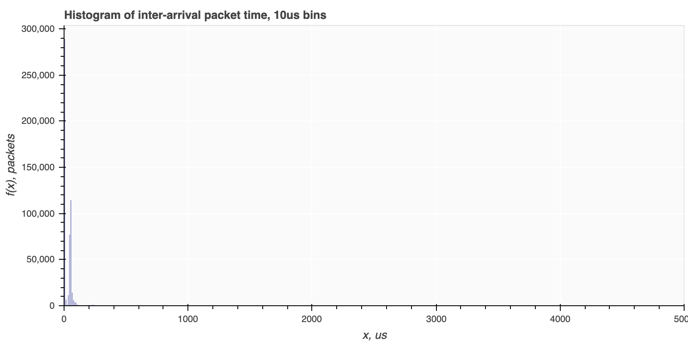
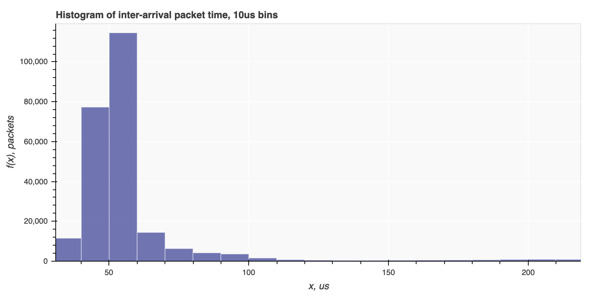
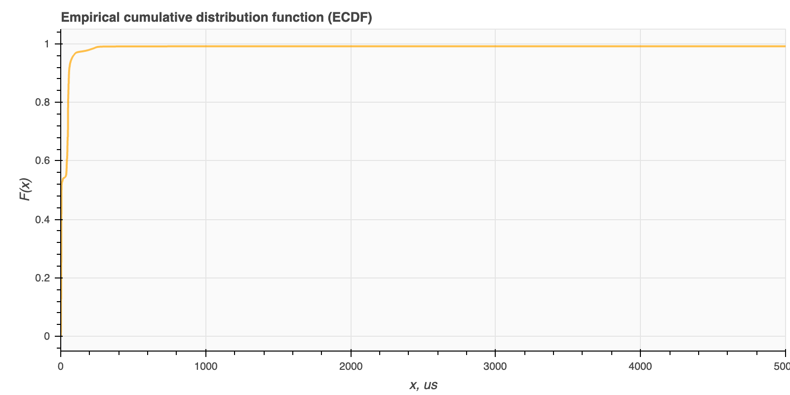
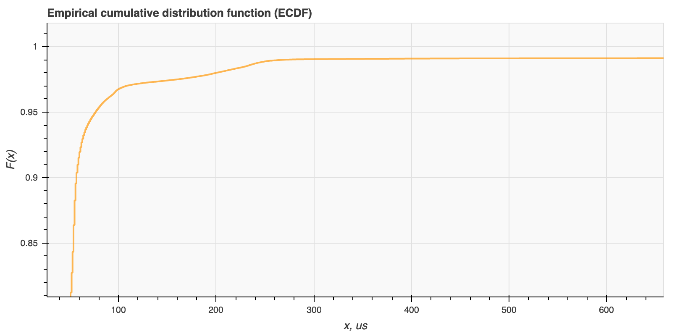

# srt-packet-iat

This script parses `.pcapng` tcpdump trace file captured at the receiver side and perform packet inter-arrival times analysis.

# Getting Started

## Requirements

* python 3.6+
* Custom library [lib-tcpdump-processing](https://github.com/mbakholdina/lib-tcpdump-processing) (included in `requirements.txt`)

To install the library dependencies run:
```
pip install -r requirements.txt
```

# Script Usage

The main purpose of `srt-packet-iat` script is to parse `.pcapng` tcpdump trace file captured at the receiver side, process the data as described in readme of [lib-tcpdump-processing](https://github.com/mbakholdina/lib-tcpdump-processing) and perform packet inter-arrival time distribution analysis. SRT DATA (all data packets including probing packets) and SRT DATA probing packets only are supported.

`.pcapng` filepath should be passed as an argument to the script. Script usage:
```
Usage: packet_iat.py [OPTIONS] PATH
```

Use `--help` to get the full list of script options
```
Options:
  --type [data|probing]         Packet type to analyze: SRT DATA (all data
                                packets including probing packets) or SRT DATA
                                probing packets only.  [default: data]
  --overwrite / --no-overwrite  If exists, overwrite the .csv file produced
                                out of the .pcapng tcpdump trace one at the
                                previous iterations of running the script.
                                [default: False]
  --help                        Show this message and exit.
```

**Note:** The inter-arrival time for the first SRT data packet by default is equal to 0, that's why this packet is excluded from the analysis.

# Tabs Description

The output of the script is the multitab `.html` file generated with the help of [bokeh](https://docs.bokeh.org/en/latest/index.html) library. The description of the tabs is provided below.

## Tab: Exploratory Data Analysis

The _Exploratory Data Analysis_ tab consists of the following tables and graphs:
* Inter-arrival packet time in microseconds vs Time in seconds graph,
* Table with basic statistics: percentiles, inter-quartile range (IQR), mean, standard deviation, etc.,
* Barchart of the number of packets vs inter-arrival packet time diaposon in microseconds (0-10, 10-100, 100-500 microseconds, etc.),
* Table of the number of packets, packets cumsum in absolute/percentage value vs inter-arrival packet time diaposon in microseconds (0-10, 10-100, 100-500 microseconds, etc.),
* Histograms regular and normalized of the inter-arrival packet time, 100 microseconds bins,
* Histograms regular and normalized of the inter-arrival packet time, 10 microseconds bins,
* Empirical Cumulative Distribution Function (ECDF) of the packet inter-arrival time.

### Histograms

Packet inter-arrival time was split into intervals: _((n - 1) x 100, n x 100]_, _n &#8712; [1, 5000]_ for 100 microseconds bins and _((n - 1) x 10, n x 10]_, _n &#8712; [1, 50000]_ for 10 microseconds bins. Higher numbers of the intervals is not used due to the lower number of packets falling into them.

Graphs plot the histograms to the amount it reveals the trend cutting the long tails. 

_Fig. 1_ corresponds to the regular 10 microseconds bins histogram of packet inter-arrival time, which zoomed version (_Fig. 2_) shows, for example, that approximately 77000 packets have the inter-arrival time falling into 40-50 microseconds interval and almost 114500 packets have the inter-arrival time falling into 50-60 microseconds interval.

 _Fig. 1. Histogram of inter-arrival packet time, 10 microseconds bins_

 _Fig. 2. Histogram of inter-arrival packet time, 10 microseconds bins, zoomed_

### Empirical Cumulative Distribution Function (ECDF)

Graph plots the ECDF to the amount it reveals the trend cutting the long tails. 

_Fig. 3_ corresponds to the ECDF of packet inter-arrival time distribution, which zoomed version (_Fig. 4_) shows, for example, that 95% of all the packets arrive in less than 76 microseconds and almost 97% of all the packets arrive in less than 100 microseconds.

 _Fig. 3. Empirical Cumulative Distribution Function of inter-arrival packet time_

 _Fig. 4. Empirical Cumulative Distribution Function of inter-arrival packet time, zoomed_

## Tab: Statistics - Outliers Removed

Tab _Statistics - Outliers Removed_ contains tables with basic statistics, e.g., percentiles, inter-quartile range (IQR), mean, standard deviation, etc., once the outliers have been removed from the original sample of packet inter-arrival times.